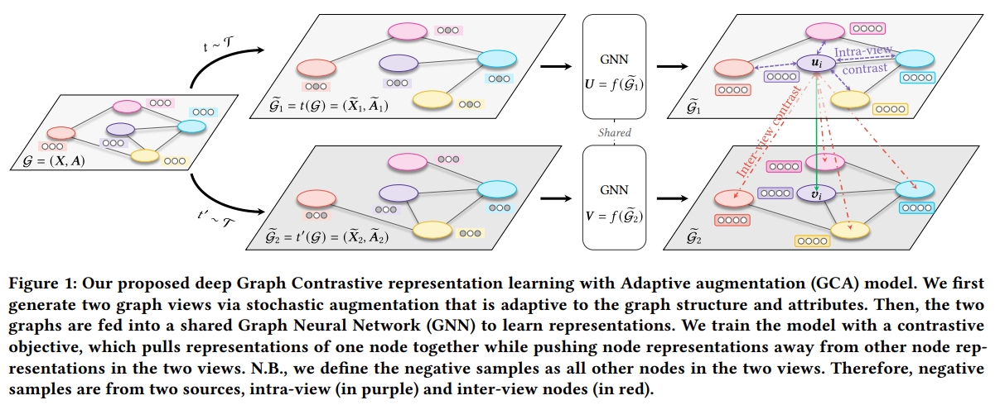

# GCA



This is the code for the WWW 2021 Paper: [Graph Contrastive Learning with Adaptive Augmentation](https://dl.acm.org/doi/abs/10.1145/3442381.3449802).

## Usage

For example, to run GCA-Degree under WikiCS, execute:
```
python train.py --device cuda:0 --dataset WikiCS --param local:wikics.json --drop_scheme degree
```

## Requirements


## Citation

Please cite our paper if you use the code:
```
@inproceedings{zhu2021graph,
  title={Graph contrastive learning with adaptive augmentation},
  author={Zhu, Yanqiao and Xu, Yichen and Yu, Feng and Liu, Qiang and Wu, Shu and Wang, Liang},
  booktitle={Proceedings of the Web Conference 2021},
  pages={2069--2080},
  year={2021}
}
```


